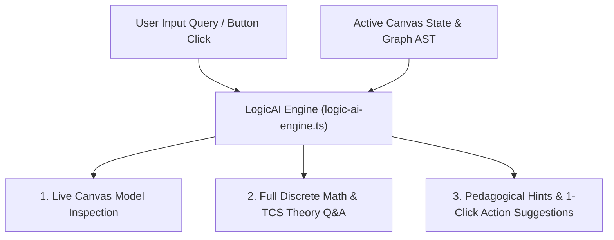

# LogicVerse AI Tutor & Context-Aware Assistant Architecture Guide

> **Module**: 09 / AI Assistant & Interactive Tutor Engine  
> **Target Audience**: Students, Educators, Software Engineers, Automata Theorists  
> **Interactive Component**: `LogicAI Drawer / Panel` (`LogicAiPanel`)

---

## 1. Executive Summary & Capabilities

The **LogicVerse AI Tutor** (`LogicAI`) is an embedded, context-aware artificial intelligence assistant engineered specifically for Discrete Mathematics, Formal Logic, Automata Theory, and Theoretical Computer Science.

Unlike generic LLM chatbots, **LogicAI directly inspects live workspace state**:
1. **Canvas Topology**: Analyzes active state nodes, transition edge labels, gate wiring, and set diagrams.
2. **Execution Traces**: Evaluates step-by-step simulations across DFA/NFA strings, CFG parse trees, PDA stack memories, and Turing Machine tapes.
3. **Formal Verification**: Detects invalid connections, non-deterministic transitions, unreachable states, or circular graph dependencies.
4. **Pedagogical Guidance**: Generates contextual hints, mathematical proofs, LaTeX formulas, and interactive template triggers.

---

## 2. Supported Domain Solvers & Modules

### 1. Set Theory & Foundations (`set-theory`)
- Explains Union ($A \cup B$), Intersection ($A \cap B$), Difference ($A \setminus B$), Symmetric Difference ($A \oplus B$), and Power Sets ($\mathcal{P}(A)$).
- Evaluates Principle of Inclusion-Exclusion (PIE) $n$-set formulas.
- Explains Cantor's Diagonalization proof for uncountability ($|\mathbb{R}| > |\mathbb{N}|$).

### 2. Propositional Logic (`logic`)
- Evaluates Well-Formed Formulas (WFF) and truth table interpretations.
- Classifies propositions into **Tautologies ($\top$)**, **Contradictions ($\bot$)**, or **Contingencies**.
- Explains laws of logical equivalence (De Morgan's, Modus Ponens, Material Implication) and Mathematical Induction proofs.

### 3. Relations & Functions (`relations-functions`)
- Inspects binary relation matrices $M_R$ for **Reflexive**, **Symmetric**, **Transitive**, and **Antisymmetric** properties.
- Explains Warshall's Algorithm for $O(n^3)$ transitive closure calculation.
- Analyzes function mappings for **Injective (1-to-1)**, **Surjective (onto)**, and **Bijective** classifications.

### 4. Finite Automata (`automata`)
- Explains step-by-step DFA/NFA/$\varepsilon$-NFA string execution.
- Details Subset Construction for $\varepsilon$-NFA $\rightarrow$ DFA conversion.
- Explains Hopcroft DFA Minimization partition refinement steps.
- Explains Moore and Mealy transducer outputs.

### 5. Regular Expressions (`regex`)
- Converts Regex syntax into Abstract Syntax Trees (AST).
- Explains Thompson's Construction algorithm for RE $\rightarrow$ NFA.
- Provides adversary game hints for Pumping Lemma proofs for Regular Languages.
- Explains Myhill–Nerode equivalence classes and distinguishability matrices.

### 6. Context-Free Grammar (`cfg`)
- Explains derivation steps $S \Rightarrow^* w$ and parse tree hierarchy.
- Details Chomsky Normal Form (CNF) 4-step reduction (START, $\varepsilon$-rules, unit rules, binary productions).
- Explains CYK dynamic programming matrix entries $V_{i,j}$.

### 7. Pushdown Automata (`pda-tm` / PDA)
- Inspects LIFO stack memory configurations $(q, w, \gamma)$.
- Explains stack push, pop, and no-op transitions $\delta(q, a, X) \rightarrow (p, \gamma)$.
- Compares **Acceptance by Final State** vs **Acceptance by Empty Stack**.

### 8. Turing Machines (`pda-tm` / TM)
- Inspects 2-way infinite tape memory cells and scanned head symbol position.
- Explains head movement directions ($L, R, S$).
- Details decidability, Universal Turing Machines (UTM), and the Halting Problem ($A_{TM}$).

---

## 3. UI Architecture & Quick Prompt Chips

The AI Assistant panel features dynamic, module-sensitive quick prompt chips:
- **`Explain this step`**: Inspects current active step in execution traces and provides pedagogical breakdown.
- **`Check validity`**: Runs formal verification checks on current canvas state.
- **`Give me a hint`**: Delivers non-spoiler hints for problem solving.
- **`Generate example`**: Automatically loads pre-built demonstration templates onto the canvas.

---

## 4. Security & GitHub Scope
- All AI Assistant components, state hooks, and solver algorithms run locally inside the Next.js client environment.
- No code or commits are pushed to GitHub without explicit user instruction.

---

## 5. Live Context Inspection Flow

